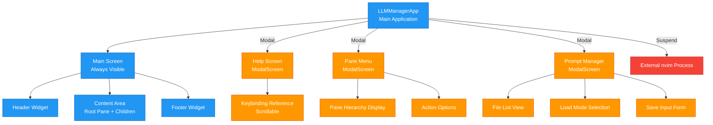
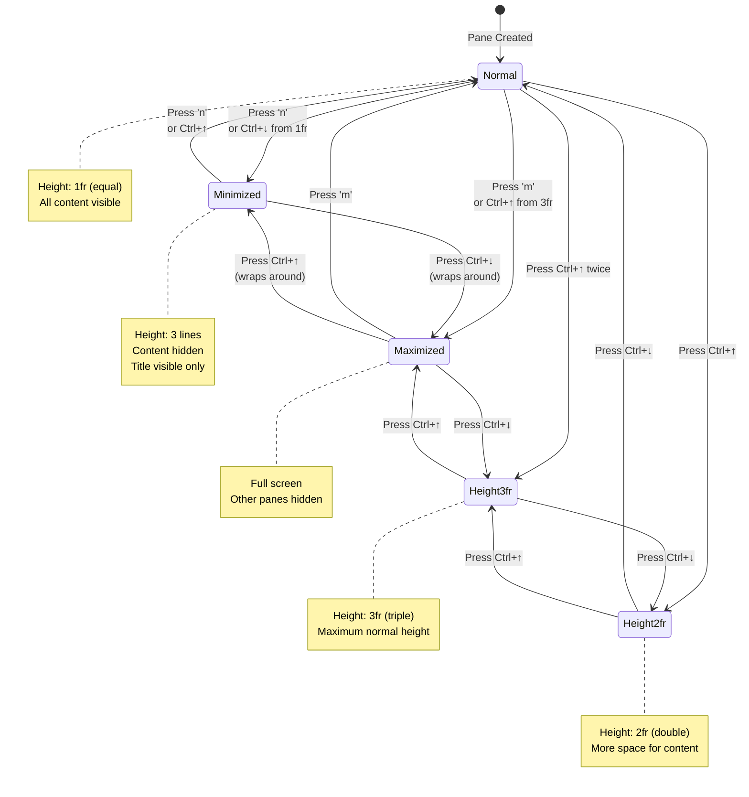
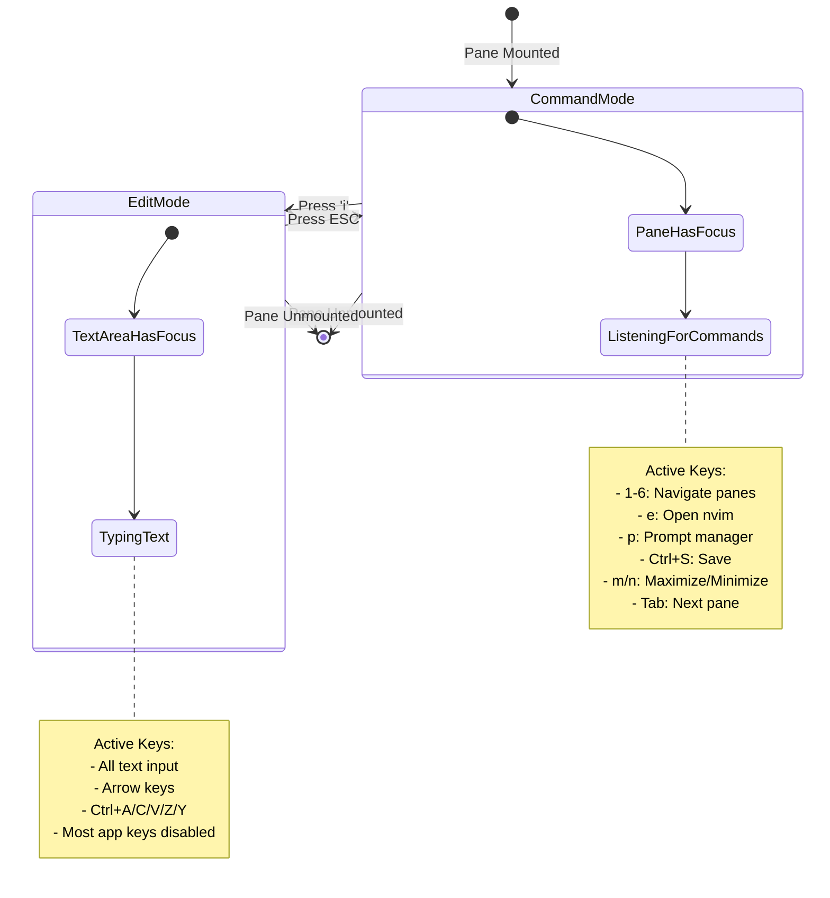
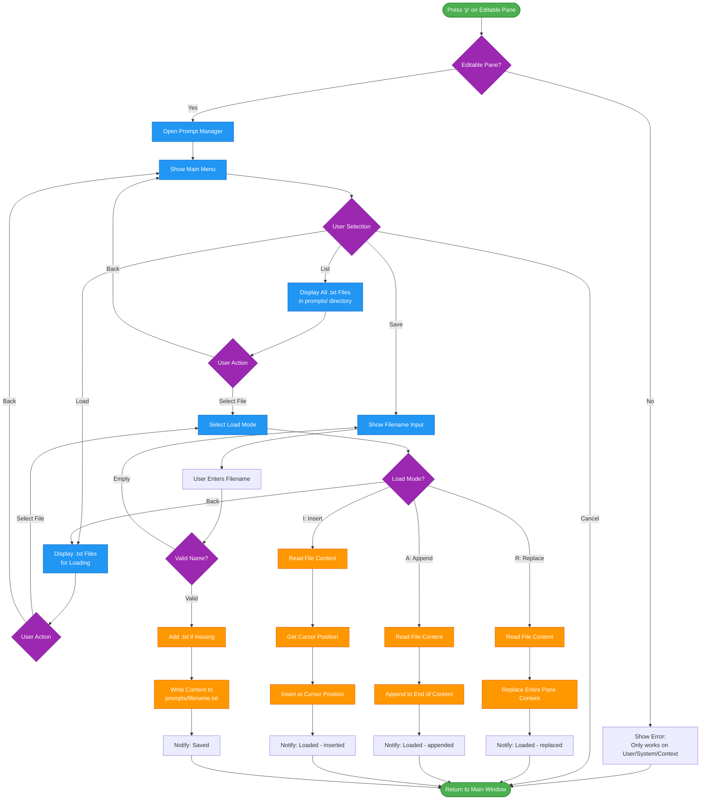
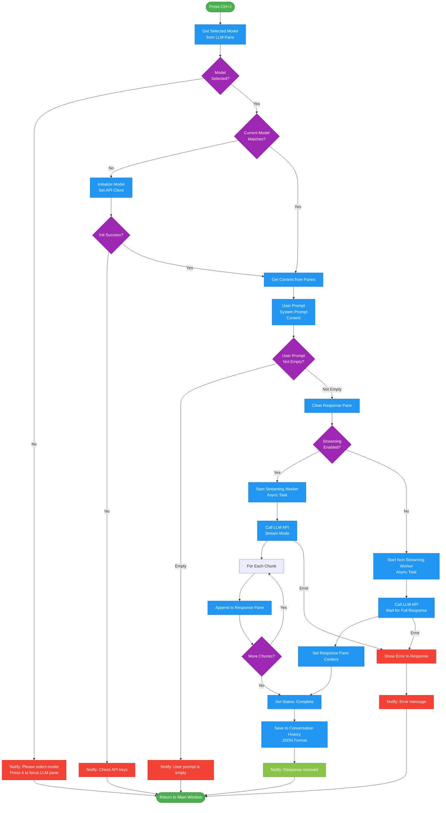

# LLM Manager - GUI Flow Diagram

## Complete Application Flow

```mermaid
graph TD
    Start([Application Launch]) --> MainWindow[Main Window<br/>LLMManagerApp]

    %% Main Window Structure
    MainWindow --> Header[Header Bar]
    MainWindow --> RootPane[Root Pane<br/>Key: 6]
    MainWindow --> Footer[Footer Bar<br/>Key Bindings Display]

    %% Root Pane Children
    RootPane --> Row1[Row 1: Horizontal]
    RootPane --> Row2[Row 2: Horizontal]
    RootPane --> Row3[Row 3: Vertical]

    Row1 --> UserPane[User Prompt<br/>Key: 1]
    Row1 --> SystemPane[System Prompt<br/>Key: 2]
    Row2 --> ContextPane[Context<br/>Key: 3]
    Row2 --> LLMPane[LLM Selection<br/>Key: 4]
    Row3 --> ResponsePane[Response<br/>Key: 5]

    %% Navigation Methods
    MainWindow -->|Tab| CycleNext[Focus Next Pane]
    MainWindow -->|Shift+Tab| CyclePrev[Focus Previous Pane]
    MainWindow -->|1-6| DirectNav[Direct Pane Focus]

    CycleNext --> MainWindow
    CyclePrev --> MainWindow
    DirectNav --> MainWindow

    %% Modal Screens
    MainWindow -->|? key| HelpScreen[Help Screen]
    HelpScreen -->|ESC/q/?| MainWindow

    MainWindow -->|ESC key| PaneMenu[Pane Menu Screen]
    PaneMenu -->|ESC/q| MainWindow
    PaneMenu --> MenuActions[Menu Actions]

    %% Pane Menu Actions
    MenuActions -->|Select Pane| FocusAction[Focus/Unhide Pane]
    MenuActions -->|Hide Pane| HideAction[Hide Selected Pane]
    MenuActions -->|Unhide Pane| UnhideAction[Unhide Selected Pane]
    MenuActions -->|Hide All| HideAllAction[Hide All Children]
    MenuActions -->|Show All| ShowAllAction[Show All Children]
    MenuActions -->|Reset Layout| ResetAction[Reset to Default Layout]

    FocusAction --> MainWindow
    HideAction --> PaneMenu
    UnhideAction --> PaneMenu
    HideAllAction --> MainWindow
    ShowAllAction --> MainWindow
    ResetAction --> MainWindow

    %% Prompt Manager Flow
    UserPane -->|p key| PromptMgrUser[Prompt Manager<br/>User Prompt]
    SystemPane -->|p key| PromptMgrSystem[Prompt Manager<br/>System Prompt]
    ContextPane -->|p key| PromptMgrContext[Prompt Manager<br/>Context]

    PromptMgrUser --> PromptMenu[Prompt Menu]
    PromptMgrSystem --> PromptMenu
    PromptMgrContext --> PromptMenu

    PromptMenu -->|List| ListPrompts[Show Prompt Files]
    PromptMenu -->|Load| LoadPrompts[Select File to Load]
    PromptMenu -->|Save| SavePrompts[Enter Filename]
    PromptMenu -->|Cancel| MainWindow

    ListPrompts -->|Select| LoadMode[Choose Load Mode]
    LoadPrompts -->|Select| LoadMode

    LoadMode -->|R: Replace| ReplaceContent[Replace Pane Content]
    LoadMode -->|A: Append| AppendContent[Append to Pane Content]
    LoadMode -->|I: Insert| InsertContent[Insert at Cursor]
    LoadMode -->|Back| LoadPrompts

    ReplaceContent --> MainWindow
    AppendContent --> MainWindow
    InsertContent --> MainWindow

    SavePrompts -->|Save| SaveFile[Write to Prompts Dir]
    SavePrompts -->|Cancel| MainWindow
    SaveFile --> MainWindow

    %% External Editor Flow
    UserPane -->|e key| NvimUser[nvim: User Prompt]
    SystemPane -->|e key| NvimSystem[nvim: System Prompt]
    ContextPane -->|e key| NvimContext[nvim: Context]

    NvimUser -->|Save & Exit| MainWindow
    NvimSystem -->|Save & Exit| MainWindow
    NvimContext -->|Save & Exit| MainWindow

    %% Edit Mode Flow
    UserPane -->|i key| EditModeUser[Edit Mode: User]
    SystemPane -->|i key| EditModeSystem[Edit Mode: System]
    ContextPane -->|i key| EditModeContext[Edit Mode: Context]

    EditModeUser -->|ESC| UserPane
    EditModeSystem -->|ESC| SystemPane
    EditModeContext -->|ESC| ContextPane

    EditModeUser -->|Type text| EditModeUser
    EditModeSystem -->|Type text| EditModeSystem
    EditModeContext -->|Type text| EditModeContext

    %% LLM Operations
    MainWindow -->|Ctrl+J| SendLLM[Send to LLM]
    SendLLM --> ValidateModel{Model Selected?}
    ValidateModel -->|No| ErrorNoModel[Notify: Select Model]
    ValidateModel -->|Yes| ValidatePrompt{User Prompt?}

    ErrorNoModel --> MainWindow

    ValidatePrompt -->|Empty| ErrorNoPrompt[Notify: Empty Prompt]
    ValidatePrompt -->|Has Text| CheckStreaming{Streaming Enabled?}

    ErrorNoPrompt --> MainWindow

    CheckStreaming -->|Yes| StreamResponse[Stream Response<br/>Show chunks in real-time]
    CheckStreaming -->|No| WaitResponse[Wait for Response<br/>Show when complete]

    StreamResponse --> UpdateResponse[Update Response Pane]
    WaitResponse --> UpdateResponse
    UpdateResponse --> SaveHistory[Save to Conversation History]
    SaveHistory --> MainWindow

    %% Response Pane Actions
    ResponsePane -->|s key| ToggleStream[Toggle Streaming Mode]
    ResponsePane -->|c key| ClearResponse[Clear Response Content]

    ToggleStream --> MainWindow
    ClearResponse --> MainWindow

    %% LLM Selection Actions
    LLMPane -->|↑/↓ keys| NavModels[Navigate Model List]
    LLMPane -->|Enter| SelectModel[Select LLM Model]

    NavModels --> LLMPane
    SelectModel --> InitModel[Initialize Model/API]
    InitModel --> MainWindow

    %% Save Operations
    MainWindow -->|Ctrl+S| SaveFocused{Which Pane Focused?}
    SaveFocused -->|User| SaveUser[Save User Prompt]
    SaveFocused -->|System| SaveSystem[Save System Prompt]
    SaveFocused -->|Context| SaveContext[Save Context]
    SaveFocused -->|Other| ErrorNoSave[Notify: No Editable Pane]

    SaveUser --> MainWindow
    SaveSystem --> MainWindow
    SaveContext --> MainWindow
    ErrorNoSave --> MainWindow

    %% Layout Management
    MainWindow -->|m key| ToggleMax[Toggle Maximize Focused Pane]
    MainWindow -->|n key| ToggleMin[Toggle Minimize Focused Pane]
    MainWindow -->|Ctrl+↑| IncHeight[Increase Pane Height]
    MainWindow -->|Ctrl+↓| DecHeight[Decrease Pane Height]

    ToggleMax --> MainWindow
    ToggleMin --> MainWindow
    IncHeight --> MainWindow
    DecHeight --> MainWindow

    %% Conversation Management
    MainWindow -->|Ctrl+E| ExportConv[Export Conversation]
    MainWindow -->|Ctrl+I| ImportConv[Import Conversation<br/>Not Implemented]

    ExportConv --> SaveJSON[Save JSON to ~/]
    SaveJSON --> MainWindow
    ImportConv --> ErrorNotImpl[Notify: Not Implemented]
    ErrorNotImpl --> MainWindow

    %% Exit
    MainWindow -->|q key| ConfirmQuit{Confirm Exit?}
    ConfirmQuit -->|Yes| Exit([Application Exit])
    ConfirmQuit -->|No| MainWindow

    %% Styling
    classDef mainStyle fill:#2196F3,stroke:#1565C0,color:#fff
    classDef paneStyle fill:#4CAF50,stroke:#2E7D32,color:#fff
    classDef modalStyle fill:#FF9800,stroke:#E65100,color:#fff
    classDef actionStyle fill:#9C27B0,stroke:#6A1B9A,color:#fff
    classDef flowStyle fill:#607D8B,stroke:#37474F,color:#fff
    classDef errorStyle fill:#F44336,stroke:#C62828,color:#fff

    class MainWindow,RootPane mainStyle
    class UserPane,SystemPane,ContextPane,LLMPane,ResponsePane paneStyle
    class HelpScreen,PaneMenu,PromptMenu,PromptMgrUser,PromptMgrSystem,PromptMgrContext modalStyle
    class SendLLM,SaveFocused,ToggleMax,ToggleMin,ExportConv actionStyle
    class ValidateModel,ValidatePrompt,CheckStreaming,ConfirmQuit flowStyle
    class ErrorNoModel,ErrorNoPrompt,ErrorNoSave,ErrorNotImpl errorStyle
```

## Screen Hierarchy

## Pane State Transitions

## Edit Mode State Machine (EditablePane)

## Prompt Manager Workflow

## LLM Send Workflow

## Key to Diagram Elements

### Node Shapes
- **Rectangle**: Screen/View
- **Rounded Rectangle**: Process/Action
- **Diamond**: Decision Point
- **Circle**: Start/End Point

### Color Coding
- **Blue** (#2196F3): Main screens/primary elements
- **Green** (#4CAF50): Panes/content areas
- **Orange** (#FF9800): Modal screens/overlays
- **Purple** (#9C27B0): Actions/operations
- **Gray** (#607D8B): Flow control/decisions
- **Red** (#F44336): Errors/external processes

### Connection Types
- **Solid Arrow**: User action/navigation
- **Dashed Arrow**: Automatic transition
- **Bold Arrow**: Primary flow path

## Usage Notes

1. **Main Flow Diagram**: Shows complete application navigation including all screens and actions
2. **Screen Hierarchy**: Shows structural relationship between persistent and modal screens
3. **State Diagrams**: Shows pane state transitions and edit mode behavior
4. **Workflow Diagrams**: Shows detailed flows for complex operations (Prompt Manager, LLM Send)

These diagrams can be viewed in any Markdown renderer that supports Mermaid (GitHub, GitLab, VS Code with extension, etc.)
